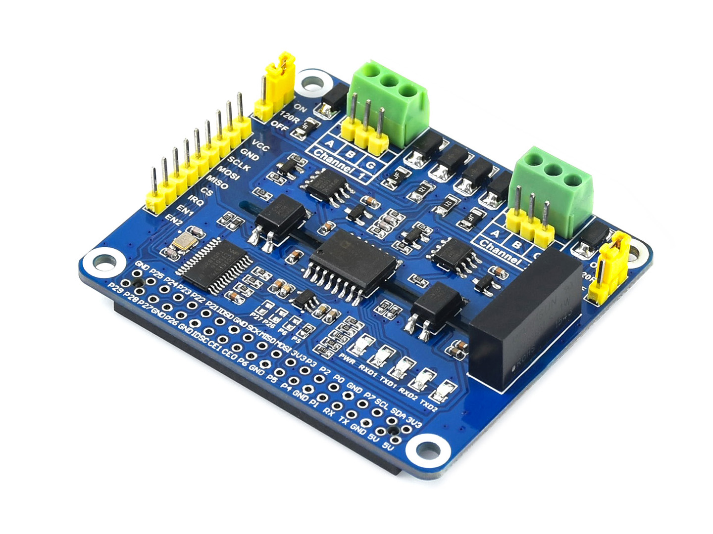
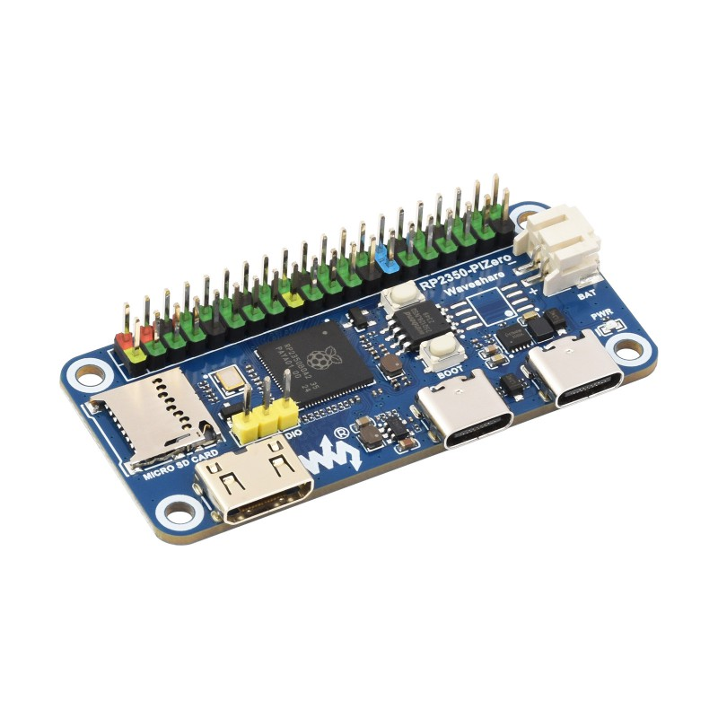

# Waveshare 2-CH RS485 HAT & RP2350-PiZero Communication Library

[](https://opensource.org/licenses/MIT)
[](https://www.raspberrypi.com/documentation/microcontrollers/rp2350.html)

A high-performance dual-channel RS485 communication library and example suite for the **2-CH RS485 HAT**, specifically ported and optimized for the **Raspberry Pi RP2350 (Pico 2)**. 

This project leverages the **SC16IS752** SPI-to-Dual-UART bridge to provide two independent RS485 channels with automatic hardware flow control, managed via a clean C-based configuration layer.

---

## 📸 Hardware Overview



The 2-CH RS485 HAT is an expansion board designed for the Raspberry Pi form factor, featuring:
* **Dual RS485 Channels**: Fully independent communication on two ports.
* **SC16IS752 Controller**: High-speed SPI interface to dual UART, offloading UART processing from the main MCU.
* **Level Conversion**: Built-in logic level conversion for stable 3.3V/5V operation.
* **Onboard Protection**: TVS (Transient Voltage Suppressor) and lightning protection.

### 🛒 Purchase Links
- **Module**: [Waveshare 2-CH RS485 HAT](https://www.waveshare.com/2-ch-rs485-hat.htm)
- **Controller**: [Waveshare RP2350-PiZero](https://www.waveshare.com/rp2350-pizero.htm)

---

## ✨ Key Features
- **Native RP2350 Support**: Full compatibility with the Pico SDK (v2.1.0+).
- **Dual-Channel Management**: Simple API to initialize and control both RS485 channels independently.
- **Hardware Flow Control**: Dedicated `TXDEN` pins for automatic half-duplex direction switching.
- **Comprehensive Examples**: Includes a robust dual-channel ping-pong communication test.
- **Efficient SPI Interface**: Uses PIO/SPI to communicate with the SC16IS752 bridge.

---

## 🛠 Hardware Mapping (RP2350)
The library is configured to use the following GPIO pins on the RP2350 (mapped to the standard 40-pin header):

| Component | Function | RP2350 GPIO | Header Pin (Pi Zero) |
|-----------|----------|-------------|----------------------|
| **SPI**   | MISO     | **GP19**    | Pin 35               |
| **SPI**   | MOSI     | **GP20**    | Pin 38               |
| **SPI**   | SCK      | **GP21**    | Pin 40               |
| **SPI**   | CS       | **GP18**    | Pin 12               |
| **IRQ**   | Interrupt| **GP24**    | Pin 18               |
| **RS485** | TXDEN 1  | **GP27**    | Pin 13               |
| **RS485** | TXDEN 2  | **GP22**    | Pin 15               |

---

## 🚀 Getting Started

### 1. Prerequisites
- **Raspberry Pi Pico SDK** (v2.1.0 or higher)
- **CMake** (3.13+)
- **GCC ARM Embedded Toolchain**

### 2. Build Instructions
Navigate to the `RP2350` folder to build the firmware.

#### **🐧 Linux & 🍎 macOS**
1. **Enter the project directory:**
   ```bash
   cd RP2350
   ```
2. **Create and enter build folder:**
   ```bash
   mkdir build && cd build
   ```
3. **Initialize CMake and Compile:**
   ```bash
   cmake ..
   make -j$(nproc) # Use -j$(sysctl -n hw.ncpu) on macOS
   ```

#### **🪟 Windows**
Ensure you have the **ARM GCC Toolchain**, **CMake**, and a make tool (like **MinGW** or **Ninja**) installed and added to your PATH.

**Using PowerShell:**
1. **Enter the project directory:**
   ```powershell
   cd RP2350
   ```
2. **Initialize and Build:**
   ```powershell
   mkdir build
   cd build
   cmake -G "MinGW Makefiles" ..
   cmake --build . -j4
   ```

> [!TIP]
> **Recommended for Windows:** Use the [Raspberry Pi Pico VS Code Extension](https://marketplace.visualstudio.com/items?itemName=raspberry-pi.raspberry-pi-pico). It handles the environment setup automatically and provides a one-click "Compile" button in the status bar.
#### **🎯 Build Targets**
The build process generates two main firmware files located in the `build/` directory:
- **`rs485_hat.uf2`**: Compiled from `examples/main.c`. A simple starting point for single-channel communication.
- **`rs485_pingpong.uf2`**: Compiled from `examples/dual_ping_pong.c`. A full-featured test between both channels.

To build a specific target instead of all, you can run:
```bash
# On Linux/macOS
make rs485_hat
# OR
make rs485_pingpong

# On Windows (PowerShell)
cmake --build . --target rs485_hat
# OR
cmake --build . --target rs485_pingpong
```

### 3. Deployment
After compilation, you will find `rs485_hat.uf2` and `rs485_pingpong.uf2` in the `build` directory. 
1. Connect your RP2350 board in **BOOTSEL** mode.
2. Copy the desired `.uf2` file to the RPI-RP2 drive.

---

## 📂 Project Structure
* `RP2350/` - Main development folder for Pico SDK.
    * `lib/` - Core driver files for RS485 and SC16IS752.
    * `lib/Config/` - Hardware abstraction layer and pin definitions.
    * `examples/` - Ready-to-run demo applications.
        * `main.c`: Simple channel initialization.
        * `dual_ping_pong.c`: Comprehensive test for CH1 ↔ CH2 communication.

---

## 🧪 Demo: Dual Channel Ping-Pong
The `rs485_pingpong` executable is designed to verify the hardware by looping data between the two channels.

**Wiring Instructions:**
1. Connect **CH1 A** to **CH2 A**.
2. Connect **CH1 B** to **CH2 B**.

**Expected Output:**
The program will transmit "Hello from CH1" and verify receipt on CH2, then perform the reverse. All logs are output via **USB Serial (stdio)** at 115200 baud.

---

## 👤 Author
Developed and ported by the Waveshare team & community contributors.

## 📄 License
This project is licensed under the MIT License.
